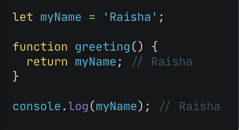
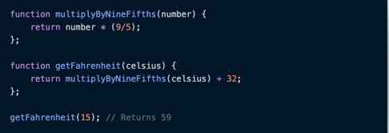
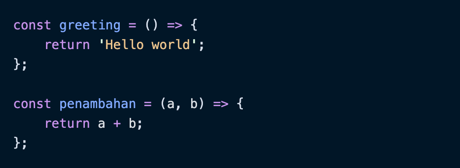
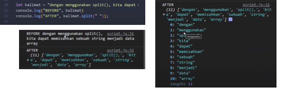
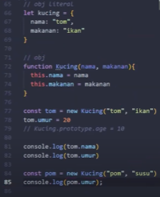
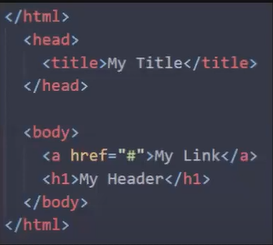
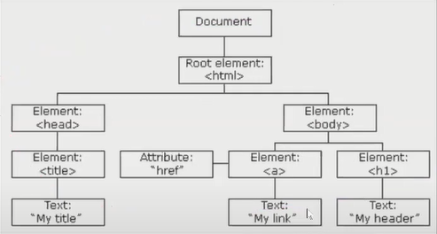

# Writing and Presentation Test Week 2

---

## Day 1 - Javascript Dasar - Scope & Function

### Scope

Scope merupakan konsep dalam flow data variabel.

#### Block

Block merupakan code yang berada di dalam curly braces {}. Conditional, function, dan looping biasanya menggunakan blocks.

### Global Scope

Global scope merupakan variabel yang dapat kita buat dan dapat kita akses dimanapun dalam suatu file. Agar menjadi global scope, suatu variabel harus dideklarasikan diluar blocks.



### Local Scope

Local scope merupakan variabel yang dapat kita deklarasikan didalam blocks. Maka variabel hanya bisa diakses didalam blocks saja. Tidak bisa diakses diluar blocks.


### Function

Function merupakan sebuah blok kode dalam sebuah grup untuk menyelesaikan 1 task/1 fitur. Saat kita membutuhkan fitur tersebut nantinya, kita bisa kembali menggunakannya.


### Membuat Function

1. **Function clasic**

```java
    function myFunction(kondisi) { }
```

2. **Function variable**

```java
    let myFunction = function (kondisi) { }
```

3. **Arrow function**

```java
    let myFunction = (kondisi) => { }
```


### Memanggil Function

```java
    greeting() //call the function name
    console.log(greeting()); //output: 'Hello world'
```

### Parameter dan Argumen

**Parameter Function**
Dengan parameter, function dapat menerima sebuah inputan data dan menggunakannya untuk melakukan task/tugas. Saat membuat function/fitur, kita harus tahu data-data yang dibutuhkan. Misalnya saat membuat function penambahan 2 buah nilai, data yang dibutuhkan adalah 2 buah nilai tersebut.

```java
function penambahan(a, b){
    return a + b;
}
```

**Argumen Function**
Argumen merupakan nilai yang digunakan saat memanggil function. Jumlah argumen harus sama dengan jumlah parameter. Jadi jika function penambahan terdapat 2 parameter nilai saat membuat function, maka saat memanggil function kita gunakan 2 buah nilai argumen.

```java
function penambahan(a, b){
    return a + b;
}
console.log(penambahan(5, 5)) //output: 10
```

### Default Parameters

Default parameter digunakan untuk memberikan nilai awal/default pada parameter function. Default parameters bisa digunakan jika kita ingin menjaga function agar tidak error saat dipanggil tanpa argumen

```java
function greetOnWebsite(name = 'Stranger'){
    return 'Hello ' + name;
}
console.log(greetOnWebsite('David')); //output: 'Hello David'
console.log(greetOnWebsite()); //output: 'Hello Stranger
```

### Function Helper

Kita bisa menggunakan function yang sudah dibuat pada function lain.



### Arrow Function

Arrow function merupakan cara lain menuliskan function. Fitur terbaru yang ada pada ES6 (Javascript Version)



---

## Day 2 - JavaScript Dasar - Data Type Built-in - Prototype and Method

### Dynamic and Weak Typing

Javascript merupakan tipe bahasa yang dinamis. Variabel dalam javascript tidak secara langsung terkait dengan jenis nilai tertentu, dan variabel apapun dapat diberikan (ditetapkan kembali) nilai dari semua jenis:

```java
let foo = 42; //foo is now a number
foo = "bar" //foo is now a string
foo = true; //foo is now a boolean
```

### Javascript Types

Kumpulan jenis dalam bahasa javascript terdiri dari primitif dan objek.

**Primitif**
Tipe data dasar, seperti:

- Boolean
- Null
- BigInt
- String
- Simbol

**objek**
Tipe data pengembangan dari tipe data dasar, seperti:

- Array
- Objek

### Determining types using the **typeof** operator

Typeof operator dapat digunakan untuk membantu dalam menentukan atau mengecek tipe data.


### String

Objek String digunakan untuk mewakili dan memanipulasi urutan karakter. String berguna untuk menyimpan data yang dapat direpresentasikan dalam bentuk teks. Beberapa operasi yang paling sering digunakan pada string adalah memeriksa panjang (length), membangun dan menggabungkannya menggunakan operator string + dan +=, memeriksa keberadaan atau lokasi substring dengan metode indexOf(), atau mengekstrak substring dengan metode substring().

### Properties (Ciri-ciri)

Sebuah nilai.

**String length**
Properties length digunakan untuk mengetahui berapa banyak karakter string.

```java
let hewan = "kelinci"
console.log(hewan.length);
```

### Methods (Keahlian)

Method merupakan sebuah fungsi.

**toLowerCase()**
Mengubah string menjadi huruf kecil semua.

```java
console.log(hewan.toLowerCase());
```

**toUpperCase()**
Mengubah string menjadi huruf besar semua.

```java
console.log(hewan.toUpperCase());
```

**charAt()**
Method charAt digunakan untuk mengembalikan string baru dan hanya 1 karakter saja. Method charAt ini akan mengembalikan sebuah karakter berdasarkan indeks (number) yang sudah ditentukan.


**includes()**
Method includes digunakan untuk melakukan pencarian. Jika ditemukan akan mengembalikan nilai true, sedangkan jika tidak ditemukan maka akan mengembalikan nilai false.


**split()**
Method split membutuhkan sebuah pola, lalu dari pola tersebut akan membagi dari string yang kita tuju. Setelah dibagi, akan membuat data array.



### Number

**NaN**
NaN merupakan Not a Number, digunakan untuk mengecek apakah ia number atau bukan.


**toString()**
Method toString() digunakan untuk mengumber number menjadi sebuah string.


**toFixed()**
Method toFixed() dapat digunakan untuk mengambil beberapa angka yang berada di belakang koma.


### Math

Math merupakan objek bawaan yang memiliki properti dan metode untuk konstanta dan fungsi pada matematika.

**abs()**
Method abs() digunakan untuk mengembalikan nilai absolut (angka bulat) dan tidak boleh ada min(negatif).

```java
math.abs(-13) //output: 13
```

**pow()**
Method pow() digunakan untuk menampilkan pangkat.

```java
math.pow(3, 2) //output: 9
```

**sqrt()**
Methode sqrt() digunakan untuk menampilkan akar.

```java
math.sqrt(9) //output: 3
```

**round()**
Method round() digunakan untuk membulatkan angka desimal menjadi bilangan bulat. Pembulatan ke atas bila angka di belakang koma lebih besar atau sama dengan 5, dan pembulatan ke bawah jika angka di belakang koma kurang dari 5.

```java
let bilangan1 = 5.7;
let bilangan2 = 5.4;

console.log(Math.round(bilangan1)); // Output: 6
console.log(Math.round(bilangan2)); // Output: 5
```

**floor()**
Method floor() digunakan untuk membulatkan angka desimal ke bawah.

```java
let bilangan1 = 5.7;
let bilangan2 = 5.4;

console.log(Math.floor(bilangan1)); // Output: 5
console.log(Math.round(bilangan2)); // Output: 5
```

**ceil()**
Method ceil() digunakan untuk membulatkan angka desimal ke atas.

```java
let bilangan1 = 5.7;
let bilangan2 = 5.4;

console.log(Math.ceil(bilangan1)); // Output: 6
console.log(Math.ceil(bilangan2)); // Output: 6
```

**random()**
Method random() digunakan untuk menampilkan angka secara acak antara 0 hingga 1 (0 termasuk. 1 tidak).

```java
console.log(Math.random()); // Output: 0.14087695004117018
console.log(Math.random()); // Output: 0.17923176966306498
```

### Object Prototypes

Prototypes merupakan mekanisme, yang mana javascript objek yang dapat menurunkan fitur-fiturnya. Tetapi bisa menambahkan fitur yang tidak ada.


Cara menggunakan objek:


---

## Day 3 JavaScript Dasar - DOM Introduction - Selecting Elements - Traversing Elements

### DOM (Document Object Model)

DOM merupakan jembatan supaya bahasa pemrograman dapat berinteraksi dengan dokumen HTML. Dengan DOM, javascript dapat mengubah, memanipulasi tampilan website (struktur HTML).

**Perubahan File HTML menjadi DOM**

- File HTML
  

- DOM (Berbentuk tree structure)
  

**DOM dan Javascript**
DOM bukan bagian dari bahasa JavaScript, melainkan Web API yang digunakan untuk membangun situs web. Cara akses DOM menggunakan javascript bisa menggunakan program interface seperti get element, web selector, dsb. DOM tidak bisa digunakan pada server.

Setelah mengakses sebuah DOM kita akan mendapatkan 4 item, diantaranya ada sebuah element dan node.

**Element**

- Cuma HTML element

Contoh :

```html
<h1>Hallo</h1>
<ul>
  <li>Satu</li>
  <li>Dua</li>
  <li>Tiga</li>
</ul>
```

**Node**
Node merupakan bagian-bagian terkecil yang berada di HTML. Seperti text, coment.

### Traversing

| Bawah                  | Atas          | Samping                |
| ---------------------- | ------------- | ---------------------- |
| getElementByID         | parentElement | nextElementSibling     |
| getElementsByClassName | closest()     | previousElementsibling |
| getElementsByTagName   |
| querySelector Family   |

**getElementByID()**
getElementByID merupakan metode untuk mengembalikan elemen dengan nilai yang ditentukan. getElementByID akan mengembalikan nilai null jika elemen itu tidak ada. getElementByID merupakan salah satu metode paling umum di DOM HTML karena hampir digunakan setiap kali ingin membaca atau mengedit elemen HTML.

```java
let title = document.getElementById("title");
console.log(title);
```

**getElementsByClassName()**
getElementsByClassName merupakan metode yang digunakan untuk mengembalikan kumpulan elemen dengan nama class. getElementsByClassName akan mengembalikan HTML Collection. Properti getElementsByClassName bersifat hanya bisa membaca.

File HTML :

```html
<!DOCTYPE html>
<html lang="en">
  <head>
    <meta charset="UTF-8" />
    <meta http-equiv="X-UA-Compatible" content="IE=edge" />
    <meta name="viewport" content="width=device-width, initial-scale=1.0" />
    <title>Document</title>
  </head>
  <body>
    <h1 id="title">Hallo</h1>

    <ul class="list">
      <li class="item">Satu</li>
      <li class="item">Dua</li>
      <li class="item">Tiga</li>
    </ul>

    <script src="./script.js"></script>
  </body>
</html>
```

File Java :

```java
let item = document.getElementsByClassName("item")
console.log(item);
console.log(item[1]);
```

**getElementsByTagName()**
getElementsByTagName merupakan metode yang dapat digunakan untuk mengembalikan koleksi semua elemen dengan nama tag yang ditentukan. Properti getElementsByTagName bersifat hanya-baca.

```java
let itemByTag = document.getElementsByTagName("li")
console.log(itemByTag);
```

Semua getElements akan mengembalikan HTML Collection. Cara akses nya mirip seperti array.

**querySelector Family**
Metode querySelector() mengembalikan elemen anak pertama yang cocok dengan pemilih CSS tertentu dari suatu elemen.
Contoh penggunaan querySelector :

```java
let listQuery = document.querySelector(".list")
console.log(listQuery);

let itemQuery = document.querySelector(".item")
console.log(itemQuery);
```

Metode querySelectorAll() mengembalikan kumpulan elemen turunan elemen yang cocok dengan pemilih CSS tertentu, sebagai objek NodeList statis.
Contoh penggunaan querySelectorAll :

```java
let itemQueryAll = document.querySelectorAll(".item")
console.log(itemQueryAll);
```

Output querySelector akan menampilkan HTML collection, sedangkan querySelectorAll akan menampilkan NodeList.

**parentElement**
Properti parentElement mengembalikan elemen induk dari elemen yang ditentukan.

```java
let itemQuery = document.querySelector(".item")
console.log(itemQuery.parentElement);
```

**closest**
Metode closest() digunakan untuk mencari pohon DOM untuk elemen yang cocok dengan pemilih CSS yang ditentukan. Metode closest() akan mengembalikan null() jika tidak ditemukan kecocokan.

```java
let itemQuery = document.querySelector(".item")
console.log(itemQuery.closest("body"));
console.log(itemQuery.closest(".list")); //menggunakan titik karena class
```

**previousElementSibling**
Properti PreviousElementSibling dapat mengembalikan elemen sebelumnya di tingkat tree yang sama. Properti PreviousElementSibling bersifat hanya-baca.

```java
let itemQuery = document.querySelector(".item")
console.log(itemQuery.previousElementSibling);
```

**nextElementSibling**
Properti nextElementSibling dapat mengembalikan elemen berikutnya di tingkat pohon yang sama. Properti nextElementSibling bersifat hanya-baca.

```java
let itemQuery = document.querySelector(".item")
console.log(itemQuery.nextElementSibling);
```

### HTML Collection

HTML collection merupakan kumpulan (daftar) elemen HTML seperti array. Elemen dalam HTML Collection dapat diakses dengan indeks (dimulai dari 0).

**Properties and Method**
Berikut properti dan method yang dapat digunakan pada HTML Collection:

- length : Mengembalikan jumlah elemen dalam HTMLCollection.
- item() : Mengembalikan elemen pada indeks tertentu.
- namedItem() : Mengembalikan elemen dengan id yang ditentukan.

**Not an Array**
HTML Collection bukan sebuah array! Sebuah HTMLCollection mungkin terlihat seperti sebuah array, tetapi sebenarnya tidak. Kita dapat mengulang melalui HTMLCollection dan merujuk ke elemennya dengan indeks. Tetapi kita tidak dapat menggunakan metode Array seperti Push(), pop(), atau join() pada HTMLCollection.

### Perbedaan HTML Collection dan NodeList

Sebuah HTMLCollection adalah kumpulan elemen dokumen. Sedangkan NodeList adalah kumpulan node dokumen (node ​​elemen, node atribut, dan node teks).

Item HTMLCollection dapat diakses dengan nama mereka, id, atau nomor indeks. Sedangkan item NodeList hanya dapat diakses dengan nomor indeksnya.

Sebuah HTML collection merupakan live collection. Contoh: Jika kita menambahkan elemen "<li>" ke daftar di DOM, daftar di HTMLCollection juga akan berubah.

Sedangkan NodeList merupakan statis collection. Contoh: Jika kita menambahkan elemen "<li>" ke daftar di DOM, daftar di NodeList tidak akan berubah.

---

## Day 4 - JavaScript Dasar - DOM - Manipulating Elements & Manipulating Styles

### Manipulating

-              | Attribute       | Class & Style            |
  ---- | ---- | ------ |
  createElement | p.attrbutes | p.className |
  createTextNode | p.getAtribute() | p.classList |
  append | p.setAtribute() | p.classList.add() |
  appendChild | p.hasAtribute() | p.classList.remove() |
  innerText | | p.classList.togle() |
  innerHTML | | p.style.color |
  textContent | | p.style.background |
  remove | | p.style.removeProperty() |

**Manipulating Elements**

- createElement() : digunakan untuk membuat elemen baru.
- createTextNode() : digunakan untuk membuat teks node.
- append() : digunakan untuk menyisipkan node setelah node child terakhir dari node parent.
- appendChild() : digunakan untuk menambahkan node ke daftar node child dari node parent yang ditentukan.
- innerText : digunakan untuk mendapatkan dan mengatur konten HTML dari suatu elemen.
- innerHTML : digunakan untuk mendapatkan dan mengatur konten HTML dari suatu elemen.
- textContent : digunakan untuk mendapatkan dan atur konten teks dari sebuah node.
- remove : digunakan untuk menghapus sebuah elemen.

**Working with Atribute**

- p.attrbutes : digunakan untuk melihat isi atribut dari sebuah elemen.
- p.getAttribute() : digunakan untuk mendapatkan suatu atribut dari sebuah elemen.
- p.setAttribute() : digunakan untuk menambahkan atau mengatur atribut dari sebuah elemen.
- p.hasAttribute() : digunakan untuk memeriksa apakah suatu elemen memiliki atribut tertentu atau tidak.

**Manipulating Element's Styles**

- p.className : digunakan untuk mengembalikan daftar kelas CSS yang dipisahkan oleh sebuah kelas elemen.
- p.classList : digunakan untuk memanipulasi kelas CSS dari suatu elemen.
- p.classList.add() : digunakan untuk menambahkan satu atau lebih kelas CSS ke daftar kelas elemen.
- p.classList.remove() : digunakan untuk menghapus kelas CSS dari daftar kelas elemen.
- p.classList.togle() : Jika daftar kelas elemen berisi nama kelas tertentu, metode toggle() dapat menghapusnya. Jika daftar kelas tidak berisi nama kelas, metode toggle() dapat menambahkannya ke daftar kelas.
- p.style.color : Untuk mengatur inline style, kita dapat menggunakan properti style elemen. Dan untuk mengatur warna elemen dapat menggunakan property style.color.
- p.style.background : digunakan untuk mengatur background pada suatu elemen.
- p.style.removeProperty() : digunakan untuk menghapus properti pada suatu elemen.

**Cara penggunaan DOM Manipulating Elements & Manipulating Styles**
File HMTL :

```html
<!DOCTYPE html>
<html lang="en">
  <head>
    <meta charset="UTF-8" />
    <meta http-equiv="X-UA-Compatible" content="IE=edge" />
    <meta name="viewport" content="width=device-width, initial-scale=1.0" />
    <title>Document</title>
  </head>
  <body>
    <div id="tess"></div>
    <div id="app"></div>

    <div id="end">
      <a href="google.com" class="link">Google</a>
    </div>

    <script src="./script.js"></script>
  </body>
</html>
```

File Java :

```java
let app = document.getElementById("app")
console.log(app);

app.innerHTML = "<h1>Hallo</h1>"
// app.innerText = "<h1>Apa Kabar?</h1>"

let p = document.createElement("p")
p.innerText = "Ini adalah paragraf"

app.append(p)

let p2 =document.createElement("p")
p2.innerText = "Paragraf ke-2"
app.append(p2)

app.append("Menggunakan append") //berbentuk string
// app.appendChild("appendchild") //appendchild tidak bisa memasukan string

let end = document.getElementById("end")
// end.remove()

let link = document.getElementsByClassName("link")[0]
console.log(link.attributes);
console.log(link.getAttribute("href"));
link.setAttribute("id","google")

//Styling
link.style.color = "black"
link.style.border = "1px solid black"
link.style.padding = "5px 20px"
link.style.backgroundColor = "aqua"
```

---

## Day 5 - JavaScript Dasar - DOM Events & Forms

### Event

Untuk menetapkan event ke elemen HTML, kita dapat menggunakan atribut:

- Click
- Submit
- Focus
- Blur
- Hover
- Change
- Scroll

### Cara Memberikan Event

Terdapat 3 cara dalam memberikan event, diantaranya:

**1. HTML Attribute**
Penggunaan HTML attribute berada pada file html.

```html
<body>
  <!-- Cara 1 memberikan event menggunakan html attribute -->
  <h1 onclick="alert('Selamat Datang')">Hallo</h1>

  <p id="paragraf">click me</p>

  <button id="btn">Klik saya</button>
</body>
```

**2. Event Property**
Penggunaan Event Property berada pada file js.

```java
let paragraf = document.getElementById("paragraf")

// cara 2 menggunakan event property
paragraf.onclick = function() {
    alert("Ini dari paragraf")
}
// paragraf.onclick = tampilkanalert

paragraf.onclick = function() {
    confirm("Apakah ini paragraf?")
}

function tampilkanalert() {
    alert("Ini alert")
}
```

**3. AddEventListener()**
Penggunaan AddEventListener berada pada file js.

```java
let paragraf = document.getElementById("paragraf")
// cara 3 menggunakan AddEventListener
let button = document.getElementById("btn")
button.addEventListener("click", function() {
    alert("Ini dari button")
})
// button.addEventListener("click", tampilkanalert)


//cara untuk menambilkan elemen dari addeventlistener
button.addEventListener("click", function(event) {
    console.log(event.target);
})

button.addEventListener("click", function() {
    confirm("Apakah ini dari button?")
})
```
