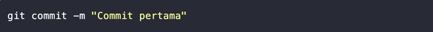
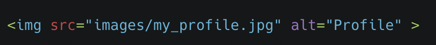
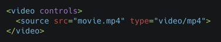
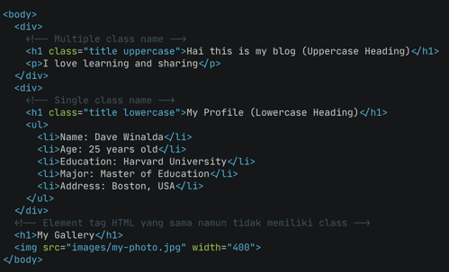
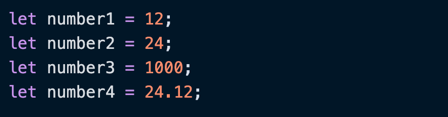
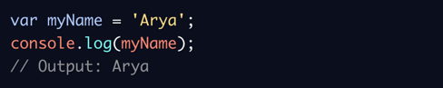

# Writing and Presentation Test Week 1

---

## Day 1 - Unix Command Line

#### Shell

Shell merupakan program yang dipakai untuk berkomunikasi atau memerintah sistem.

#### Commad Line Interface

Command Line Interface merupakan jenis shell yang berbasis teks.

#### Terminal Emulator

Terminal Emulator merupakan aplikasi yang biasa digunakan untuk mengakses cLI.

#### Cara Mengakses Shell

Cara Mengakses Shell, biasanya dapat menggunakan CLI. Berikut contoh CLI yang biasa digunakan:

- sh
- bash
- zsh
- cmd.exe

#### File System Structure

File System merupakan metode untuk memberi nama pada data, mengatur data dan meletakkannya pada media penyimpanan. Sistem operasi windows & Unix-like biasanya menyusun file dan direktori menggunakan struktur yang bentuknya mirip dengan tree.
**Contoh File System Structure:**

#### Command untuk Navigasi

- **pwd (Print Working Directory)**
  Command untuk melihat current working directory.
- **ls (Lists)**
  Command untuk melihat isi file yang ada di sebuah direktori
- **cd <direktori> (Change Directory)**
  Command untuk berpindah direktori.

#### Command untuk Membuat Files & Direktori

- **touch**
  Command untuk membuat sebuah file.
- **mkdir**
  Command untuk membuat sebuah direktori.

#### Melihat Isi Files

- **head**
  Command untuk melihat beberapa line awal dari sebuah file text.
- **tail**
  Command untuk melihat beberapa line awal dari sebuah file text.
- **cat**
  Command untuk melihat isi sebuah file.

#### Menyalin, Memindahkan, dan Menghapus Files & Directory

- **cp**
  Command untuk mengcopy files atau directory
- **cp -R**
  Command untuk menyalin directory.
- **mv (move)**
  Command untuk memindahkan files atau directory. Bisa juga digunakan untuk rename.
- **mv -R**
  Command untuk memindahkan directory
- **rm (remove)**
  Command untuk menghapus file atau directory.
- **rm -R atau rm -d**
  Command untuk menghapus directory.

---

## Day 1 - Git & Github Dasar

#### Git

Git merupakan aplikasi yang dapat melacak setiap perubahan yang terjadi pada suatu folder atau file. Git biasanya digunakan oleh programmer sebagai tempat penyimpanan file pemrograman mereka, karena lebih efektif. File-file yang disimpan menggunakan git akan terlacak seluruh perubahannya, termasuk siapa yang mengubah.

#### Github

Github merupakan situs web juga sebuah layanan cloud yang bisa membantu para pengguna (programmer) untuk menyimpan,mengelola dan mengembangkan file.

#### Kenapa Harus Menggunakan Git & Github?

Dengan Git & Github kita bisa berkolaborasi mengerjakan suatu proyek yang sama tanpa harus repot copy paste folder/file aplikasi yang terupdate. Kita bisa langsung mengerjakan suatu proyek tanpa harus menunggu rekan satu tim mengerjakannya dahulu untuk berkolaborasi.

#### Version Control system

Version Control System digunakan untuk mencatat setiap perubahan pada file (termasuk code yang kita buat) pada suatu proyek baik dikerjakan secara individu maupun tim.

#### Konfigurasi Git - Setup Awal

#### Cek Apakah Setup Berhasil

#### Membuat Repository

#### Git Status

- **Modified**
  Modified merupakan kondisi dimana revisi atau perubahan sudah dilakukan, tetapi belum ditandai **(untracked)** dan belum disimpan dalam version control.
- **Staged**
  Staged merupakan kondisi dimana revisi sudah ditandai **(modified)** namun belum disimpan di version control.
- **Committed**
  Commit/Committed merupakan kondisi dimana revisi sudah disimpan pada version control.

#### Git ADD

Setelah cek status dengan **Git status**, selanjutnya kita ubah status **untracked file** dan **unmodified** menjadi modified. Menggunakan command line:

#### Git Commit

Git Commit dilakukan untuk save perubahan pada version control. Menggunakan command line:

#### Git Log

Git LOG berfungsi untuk melihat riwayat atau history perubahan pada proyek, selain itu git log sangat berguna jika kita berkolaborasi dengan banyak orang sehingga kita tahu apa yang di ubah oleh orang lain dalam project tim yang kita kerjakan. Berikut perintah command line git log agar lebih pendek:

#### Git Checkout

Git Checkout digunakan sebagai perintah untuk mengecek kondisi file di setiap commit. Selain itu juga, perintah ini digunakan untuk berpindah dan membuat cabang. Ini bisa kita gunakan untuk membuat perubahan baru berdasarkan kode di masa lalu.

#### Git Reset

Git Reset digunakan untuk mengembalikan file ke kondisi sebelumnya, kemudian menghapus catatan sejarah commit berikutnya.

---

## Day 2 - HTML

#### HTML

HTML (Hypertext Markup Language) bukanlah sebuah bahasa pemrograman, HTML tidak bisa dinamis mengolah data. HTML dapat digunakan untuk menampilkan konten pada browser secara statis. Contoh konten yang dapat ditampilkan seperti Text, Image, Video, Link, dsb.

#### Tools HTML

Terdapat 2 tools utama yang harus dipersiapkan untuk membuat HTML, yaitu:

1. Browser (Goggle Chrome)
1. Code Editor (Visual Studio Code)

#### Visual Studio Code

Visual Studio Code merupakan code editor yang dikembangkan oleh tim engineer microsoft.
Visual Studio Code bisa digunakan untuk bahasa pemrograman apapun.

#### HTML Structure

HTML tersusun sebagai kesatuan dari sebuah tingkatan (family tree relationship). Saat sebuah element berada di dalam elemen lain, maka disebut child element. Element yang berada diatas element lain disebut parent element.

#### HTML Anatomy

#### HTML Element

#### HTML Atribute

Atribute merupakan properties dari sebuah HTML Element. Semua HTML element memiliki attribute.

#### HTML Comment

#### Cara Menjalankan HTML

Kita bisa menjalankan HTML menggunakan **Live Server** pada visual studio code. Caranya sebagai berikut:

1. Install Live Server pada Extension di Visual Studio Code
1. Jika sudah selesai install, kita bisa klik kanan pada file HTML dan pilih open with **live server**.

#### HTML Tag Populer

- Tag img digunakan untuk menampilkan gambar.
- src atau source adalah attribute untuk memberitahukan sumber gambar
  
- alt merupakan alternative. Jika gambar tidak berhasil dimunculkan kita bisa memberi tahu ke user di tag img kita menampilkan gambar apa.
- Tag video digunakan untuk menampilkan video. Video merupakan double closing tag sehingga kita menaruh konten diantara opening dan closing.
- controls berguna untuk mengatur videonya di play/pause dan indikator menit.
  

#### HTML Table

Table merupakan salah satu elemen yang akan sering kita temuka dan gunakan. Contohnya data pada admin, data user, dsb.

#### HTML Form

Form merupakan salah satu elemen yang sering digunakan untuk membuat registrasi,login, dsb.

#### Semantic HTML

Semantic artinya kita dapat menggunakan element HTML yang sesuai dengan kebutuhan konten. Seperti:

Kegunaan Semantic HTML, diantaranya:

1. Meningkatkan accessibility
1. Meningkatkan SEO
1. Lebih mudah

#### Deploy HTML

Deploy merupakan sebuah proses untuk menyebarkan aplikasi yang sudah kita kerjakan supaya bisa digunakan oleh orang-orang. Jika aplikasi kita HTML atau Web App kita perlu mendeploy ke server. Sedangkan jika palikasi kita mobile seperti Android atau IOS kita bisa deploy ke Google Play Store atau App Store. Cara mendeploy HTML menggunakan tools bernama **Netlify**, sebagai berikut:

1. Masuk ke netlify.com
1. Lakukan register menggunakan email atau github
1. Setelah itu, Masuk ke tab sites lalu drag and drop seluruh folder html yang sudah kita buat.

---

## Day 3 - CSS

#### CSS (Cascading Style Sheets)

CSS merupakan bahasa yang digunakan untuk mendesain halaman website. Dengan CSS, kita bisa mengubah warna, menggunakan font custom, editing text format, mengatur tata letak, dsb.

#### Struktur CSS

Struktur kode CSS terdiri dari tiga bagian, diantaranya:

1. Selektor
1. Blok Deklarasi
1. Properti dan nilanya.
   

#### CSS Comment

CSS Comment, digunakan untuk memberikan penjelasan atau maksud dari line code yang kita buat. Comment tidak akan dieksekusi oleh sistem. Comment hanya untuk dibaca oleh sesama programmer.

#### Cara Menggunakan CSS

Terdapat 3 cara dalam menggunakan CSS, yaitu:

1. **Inline Styles**
   Inline CSS merupakan kode CSS yang ditulis langsung pada atribut style di elemen HTML.
   
1. **CSS Internal**
   CSS internal merupakan CSS yang diletakkan pada bagian **head** suatu halaman HTML.
   
1. **CSS External**
   CSS external merupakan kita membuat file tersendiri yang berekstensi **.css**. Kemudian file tersebut kita hubungkan ke dalam halaman HTML menggunakan tag <link>.
   

#### CSS - Tag Name

Kita bisa menggunakan tag elemen HTML secara langsung pada CSS. Jika menggunakan tag element, maka ini bersifat global. Global artinya akan mempengaruhi seluruh tag elemen HTML yang ada pada file tersebut. Contoh:

- File HTML
  
- File CSS
  
- Hasil
  
  Kedua heading h1 akan ikut berubah dengan styling yang sama.

#### CSS - Class Name

kita bisa menggunakan attribute class pada elemen HTML, lalu memanggil nama class tersebut pada css. HTML yang memiliki class yang sama, akan mempunyai styling yang sama saat digunakan pada CSS. Contoh:

- File HTML
  
- File CSS
  
- Hasil
  

#### CSS - Multiple Class

Kita dapat menggunakan lebih dari 1 class yang berbeda untuk 1 element HTML. Misal, kita memiliki 2 heading yang ingin memiliki warna yang sama tetapi format heading yang satu huruf besar dan heading satunya huruf kecil. Contoh:

- File HTML
  
- File CSS
  
- Hasil
  

#### CSS - ID Name

ID Name bersifat unik artinya hanya ada 1 nama ID pada 1 Element HTML. Biasanya digunakan jika hanya ada 1 element pada 1 page. Contohnya navigation header dan footer.

- File HTML
  
- File CSS
  
- Hasil
  

#### Chaining Selectors

Chaining selector dapat kita gunakan, jika kita memiliki 3 tag element HTML pada CSS namun kita ingin ada 1 element HTML yang memiliki styling berbeda.

- File HTML
  
- File CSS
  
- Hasil
  

#### Nested Element

Konsep CSS sama dengan HTML yaitu setiap element memiliki parent dan child.

- File HTML
  
- File CSS
  
- Hasil
  

#### Multiple Selector

Multiple Selector digunakan agar code lebih efisien dan tidak repetitive (melakukan hal yang sama berulang-ulang).

- CSS Style yang belum menggunakan Multiple Selector
  
- CSS Style dengan Multiple Selector
  

#### Flexbox

Flexbox merupakan cara untuk mengatur layout secara otomatis. Flexbox memiliki 1 parent/container dan bisa beberapa child/item.

- File HTML
  
- File CSS
  
- Hasil
  

#### Ordering & Orientation

**Flex-direction**
Properti flex-direction digunakan untuk mengatur letak item child. Terdapat 4 value flex-direction, diantaranya:

1. row (default) : Secara default letak item child membentuk sebuah baris dari kiri ke kanan.
1. row-reverse : letak item child membentuk sebuah baris dari kanan ke kiri.
1. column : letak item child membentuk sebuah baris dari atas ke bawah.
1. column-reverse : letak item child membentuk sebuah baris dari bawah ke atas.
   

- File HTML
  
- File CSS
  
- Hasil
  

**Flex-wrap**
Flex Secara Default akan membuta tata letak item children dalam 1 line saja. Flex akan menyesuaikan space yang ada.
Namun jika kita ingin membatasi jumlah item children dalam 1 line lalu item children yang lain akan pindah ke posisi line yang baru, maka kita bisa menggunakan flex-wrap. Properti flex-wrap memiliki 3 value, diantaranya:

- no-wrap (default) : secara default, flex tidak menggunakan flex-wrap.
- wrap : flex item akan memiliki beberapa line dari atas ke bawah jika space dalam 1 line sudah full width.
- wrap-reserve : kebalikan dari wrap yaitu lex item akan memiliki beberapa line dari bawah ke atas jika space dalam 1 line sudah full width.
  
- File CSS
  
- Hasil
  

**Flex-flow**
Properti flex-flow digunakan sebagai shortcut untuk setup flex-direction dan flex-wrap bersamaan. Terdapat 4 value pada flex-flow, diantaranya:

1. row nowrap
1. column wrap
1. column reverse
1. row-reverse wrap-reverse

- File CSS
  
- Hasil
  

**Order**
Properti order pada flex berfungsi untuk ordering item mana yang ingin kita atur posisinya berdasarkan urutan order. Terdapat 3 value dari properti order, diantaranya:

1. -1 : Item child yang di set order -1, maka item child tersebut akan berada di ordering paling awal atau paling kiri.
1. 0 (default) : Flex secra default memiliki order 0 pada setiap item child. Berarti 0 akan membuat item child sesuai urutan pada html.
1. : Item child yang di set order 1, maka item child tersebut akan berada di ordering paling akhir atau paling kanan.

- File HTML
  
- File CSS
  
- Hasil
  
  Order 0 adalah order secara default. jadi class .item-3 tetap pada order default yaitu ke-3.

#### Aligment

**Justify-content**
Properti justify-content digunakan untuk mengatur tata letak dan space antar item child secara horizontal atau main axis. Justify-content memiliki 6 value yaitu:

1. flex-start
1. flex-end
1. center
1. space-between
1. space-around
1. space-evenly

- File HMTL
  
- File CSS
  
- Hasil
  

**Align-items**
properti align-items digunakan untuk mengatur align dari item child secara vertikal atau cross axis. Align-items memiliki5 value, diantaranya:

1. flex-start
1. flex-end
1. center
1. baseline
1. stretch

- File CSS
  
- Hasil
  

**Align-self**
Properti align-self digunakan untuk mengatur align item pada masing-masing item. Align-self memiliki 5 value yang sama dengan align-items:

1. flex-start
1. flex-end
1. center
1. baseline
1. stretch

- File CSS
  
- Hasil
  

**Align-content**
Properti elign-content memiliki konsep yang sama seperti justify-content. Align-content digunakan untuk mengatur tata letak dan space antai item child secara vertikal atau cross axis. Align-content akan berjalan jika item lebih dari 1 line/baris. Align-content memiliki value yang sama dengan justify-content, bedanya terdapat 1 tambahan value yaitu stretch.

- File HTML
  
- File CSS
  
- Hasil
  

#### Flexibility

**flex-grow**
Properti flex-grow dapat mengatur size suatu item child pada flexbox. Value dari properti flex-grow adalah number dan tidak boleh negatif.

- File HTML
  
- File CSS
  
- Hasil
  

**Flex-shrink**
Flex-shrink merupakan properti yang membuat size suatu item child mengecil secara relatif terhadap item child yang lainnya. Value dari properti flex-shrink adalah number. Number negatif dianggap tidak valid. Semakin besar value number dari properti ini, maka semakin kecil size dari suatu item child.

- File HTML
  
- File CSS
  Style.css dengan flex-Shrink yang bernilai 0.
  
  style.css dengan flex-shrink bernilai 2.
  
- Hasil
  Hasil flex-shrink bernilai 0.
  
  Hasil flex-shrink bernilai 2.
  

**Flex-basis**
Flex-basis merupakan properti yang sama fungsinya seperti width. Flex-basis mengatur width dari setiap item child. Jika kita telah mengggunakan width, maka flex-basis akan melakukan override properti width. Namun flex-basis tidak akan berjalan jika kita telah menggunakan min-width dan max-width. Properti flex-basis memiliki value:

1. auto
1. number
1. initial
1. inherit

- File HTML
  
- File CSS
  
- Hasil
  

---

## Day 4 - Algoritma

#### Apa itu Algoritma?

Algoritma merupakan metode atau langkah yang direncanakan secara tersusun dan berurutan untuk menyelesaikan atau memecahkan permasalahan dengan sebuah intruksi atau kegiatan.

#### Ciri-ciri Algoritma

#### Jenis Proses Algoritma

#### Penyajian Algoritma - Deskriptif

Penulisan algoritma dengan cara deskriptif itu sama seperti kita menulis tutorial (tata cara) menggunakan bahasa sehari-hari, Contoh:
**Mengambil air minum**

1. Pergi ke dapur
1. Ambil gelas di dalam rak
1. Pergi ke dispenser
1. Isi gelas dengan air
1. Jika air sudah penuh
1. Air siap diminum

#### Penyajian Algoritma - Flow Chart

Flow chart atau diagram alir merupakan sebuah jenis diagram yang mewakili algoritme, alir kerja atau proses, yang menampilkan langkah-langkah dalam bentuk simbol-simbol grafis, dan urutannya dihubungkan dengan panah.

#### Penyajian Algoritma - Pseudo Code

Penulisan algoritma yang hampir menyerupai penulidan pada kode pemrograman disebut dengan pseudo Code.
Pada umumnya pseudocode memiliki 3 bagian, yaitu:

1. Judul : Penjelasan dari algoritma yang dibuat
1. Deklarasi : Mendefinisikan/menyiapkan semua nama (variabel) yang akan digunakan
1. Deskripsi : Langkah-langkah penyelesaian masalah

Tidak ada aturan baku dalam penulisan pseudocode, asalkan:

- Jelas
- Simple
- Konsisten
- Mudah dibaca orang lain

---

## Day 4 - Javascript Intro

#### Apa itu Javascript?

Javascript merupakan bahasa pemrograman yang sangat powerful yang digunakan untuk logic pada sebuah website. Javascript dapat membuat website menjadi interaktif dan dinamis.

#### Menjalankan Javascript

Javascript dijalankan melalui browser pada device setiap user. Contoh : Google Chrome, Mozilla, Safari, dsb.

#### Syntax dan Statement

Syntax bisa dianalogikan seperti kosa kata (Vocabulary) dan tata cara (grammar) pada bahasa pemograman. Kita menggunakan syntax tertentu untuk membuat statement program, instruksi untuk dijalankan/dieksekusi oleh web browser, compiler, ataupun intrepreter.
Contoh syntax javascript, diantaranya:

- **Alert()**
  Dialog alert() biasanya digunakan untuk menampilkan sebuah pesan peringatan atau informasi.
  
- **Prompt()**
  Dialog prompt() berfungsi untuk mengambil sebuah inputan dari pengguna.
  
- **Confirm()**
  Dialog confirm() digunakan untuk melakukan konfirmasi dalam melakukan tindakan tertentu.
  

#### Console Log

Console log merupakan tempat kita untuk cek logic pemrograman web yang sudah kita buat/kembangkan. Console log juga bisa digunakan untuk melakukan debugging (mengetahui error pada code) di pemrograman web.

#### Comments

Comments merupakan sintaks yang digunakan untuk memberi keterangan tentang suatu statement.

- Single Comment
  
- Multiple Comment
  

#### Tipe Data (Data Types)

Tipe data merupakan klasifikasi yang kita berikan untuk berbagai macam data yang digunakan dalam programming. Terdapat 6 tipe data fundamental pada javascript, diantaranya:

1. **number**
   Tipe data number merupakan tipe data yang mengandung semua angka termasuk angka desimal. Contoh:
   
1. **string**
   Tipe data string merupakan grup karakter yang ada pada keyboard laptop/pc kita yaitu letters (huruf), number (angka), spaces (spasi), symbol, dsb. Harus diawali dan diakhiri dengan single wuotes '...' ataupun double quotes "..."
   
1. **boolean**
   Tipe data boolean merupakan tipe data yang hanya mempunyai 2 buah nilai, yaitu Tru (benar) or False (salah).
   
1. **null**
   Tipe data null merupakan tipe data yang diartikan bahwa sebuah variable yang tidak memiliki nilai. Null berbeda dengan string kosong, string kosong masih memiliki tipe data yaitu string.
   
1. **undefined**
   Tipe data undefined merupakan tipe data yang merepresentasikan variable/data yang tidak memiliki nilai. Undefined berbeda dengan null. Undefined didapat dari hasil berikut:

- Nilai dari pemanggilan variabel yang belum didefinisikan
- Nilai dari pemanggilan element array yang tidak ada
- Nilai dari pemanggilan property objek yang tidak ada

Tipe data undefined biasanya didapat dari hasil kesalahan program (error), kelalaian programmer, dan tidak direncanakan.

1. **object**
   Tipe data object merupakan koleksi data yang saling berhubungan (related). Tipe data project dapat menyimpan data dengan tipe data apapun (number, string, boolean, dsb). Tipe data object mempunyai key dan value.
   

#### Variabel

Variabel merupakan container/tempat untuk menyimpan sebuah nilai. Terdapat 3 hal yang dapat dilakukan pada variabel:

1. Membuat variabel dengan nama yang jelas dan menggambarkan tentang data tersebut
1. Menyimpan dan mengupdate informasi/data yang disimpan
1. Mendapatkan/menampilkan data yang tersimpan

Terdapat 3 cara dalam mendefinisikan sebuah variabel, yaitu:

1. var
   
1. let
   Variabel let dikenalkan pada versi javascript terbaru ES6, Mendukung kaidah global dan local variabel.
   
   Contoh perbedaan penggunaan variabel let dan var
   
1. const
   Variabel const dapat digunakan jika variabel tidak dapat diubah nilainya. Biasanya digunakan untuk menggambarkan konstanta sebuah nilai. Seperti konstantas pi = 3.14
   

**Aturan Penamaan Variabel**

1. Harus mendeskripsikan tentang data yang disimpan
1. Tidak bisa menggunakan number pada awal nama variabel
1. Gunakan cameIcase untuk penamaan yang lebih dari 1 kata.
   Contoh : myName

#### Operator

**Assignment Operator (=)**
Assignment operator digunakan untuk menyimpan sebuah nilai pada variabel.

**Increment dan Decrement**
Increment atau Decrement dapat digunakan untuk menambah atau mengurangi sebesar 1 nilai.

#### Arithmetic Operator

Arithmetic Operator merupakan operator yang melibatkan operasi matematika, diantaranya:

- Tambah (+)
- Kurang (-)
- Perkalian (\*)
- Pembagian (/)
- Modulus (%)
  Modulus merupakan hasil dari sisa bagi.
  

#### Comparison Operator

Comparison Operator merupakan operator yang membandingkan satu nilai dengan nilai lainnya. Hasil operasi yang melibatkan comparison operator adalah true or false.
**Simbol Comparison Operator**

- Lebih kecil dari : <
- Lebih besar dari : >
- Lebih kecil atau sama dengan : <=
- Lebih besar atau sama dengan : >=
- Sama dengan : ===
- Tidak sama dengan : !==
  

#### Logical Operator

Logical operator bisa digunakan untuk sebuah Conditional pada pemrograman. Menghasilkan nilai boolean yaitu true or false. Simbol dari logical Operator adalah sebagai berikut:

- **AND (&&)**
  AND akan menghasilkan nilai true jika kedua atau semua premis bernilai true.
  
- **OR (||)**
  OR akan menghasilkan nilai true jika salah satu premis mengandung nilai true.
  
- **NOT (!)**
  NOT akan mengembalikkan sebuah nilai boolean. True menjadi dalse dan sebaliknya.
  

---

## Day 5 - Javascript Conditional

#### Conditional

Conditional merupakan statement percabangan yang menggambarkan suatu kondisi. Conditional statement akan mengecek kondiis spesifik dan menjalankan perintah berdasarkan kondisi tersebut. Kondisi tersebut harus bernilai true (benar), setelah kondisi itu true maka code di dalam kondisi tersebut bida dijalankan.

#### IF Statement

Contoh conditional dalam kehidupan sehari-hari:

1. Jika haus, maka kita minum.
1. Jika lelah, maka kita istirahat.
1. Jika alarm berbunyi, maka kita akan bangun dari tidur.
   

#### IF ElSE Statement

Kondisi If akan mengeksekusi sebuah statement/code jika kondisi itu benar, sedangkan kondisi else akan mengeksekusi sebuah statement/code jika suatu kondisi bernilai false.

#### IF ELSE IF Statement

Else If Statement dapat kita gunakan jika kita mempunyai berbagai kondisi.

#### Truthy and Falsy

Nilai truthy merupakan nilai non-boolean yang dievaluasi menjadi nilai true di JavaScript. Sementara nilai falsy merupakan nilai non-boolean yang dievaluasi menjadi nilai false di JavaScript. Hanya ada enam nilai yang dievaluasi menjadi False, atau bersifat falsy, oleh JavaScript, yaitu:

1. false
1. 0 (nol)
1. “”, string kosong
1. null
1. undefined
1. NaN

#### Switch Case Conditional

Switch case digunakan jika kondisi dan percabangan terlalu banyak.

#### Ternary Operator

Operator ternary merupakan shorthand untuk percabangan if, tapi lebih singkat dan to the point.
**Sintak**

Penjelasan:

- kondisi: ekspresi yang mengembalikan nilai boolean (true atau false). Jika bukan boolean, dikonversi secara otomatis ke nilai boolean sesuai truthy dan falsy.
- ekspresiJikaTrue: ekspresi yang dievaluasi jika kondisi bernilai true.
- ekspresiJikaFalse: ekspresi yang dievaluasi jika kondisi bernilai false.

---

## Day 5 - Javascript Looping

#### Looping

Looping merupakan statement yang mengulang sebuah instruksi hingga kondisi terpenuhi atau jika kondisi stop/berhenti tercapai.

#### For Loop

For loop merupakan instruksi pengulangan yang dapat kita berikan pada program yang kita kembangkan. For loop digunakan jika kita tahu seberapa banyak nilai pasti yang diulang.
**For loop parameter**

- Inisialisasi: Sebagai inisialisasi awal dari mana mulainya sebuah pengulangan. Kita memberikan nilai awal/default pada parameter ini
- Condition: For loop akan terus berjalan selama kondisi ini terpenuhi. Selama kondisi bernilai TRUE.
- Post-expression (Increment/Decrement): Iterasi statement yang digunakan untuk mengupdate variabel yang menjadi kontrol pada pengulangan

#### While Loop

While loop akan menjalankan instruksi pengulangan kondisi bernilai true. While loop digunakan jika kita tidak mengetahui jumlah pasti pengulangan.

#### Do While

Do while digunakan jika kita ingin menjalankan pengulangan 1 kali sebelum dilakukan pengecekan kondisi.

#### Nested Loop

Nested Loop merupakan sebuah kondisi looping yang berada didalam looping. looping pertama dianalogikan sebagai baris, sedangkan looping kedua dianalogikan sebagai kolom.

